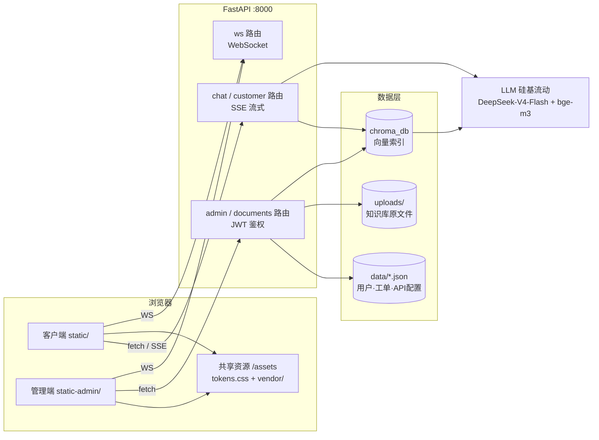

# AI 智能客服系统 · 重做方案

> **本方案讲什么**：现有 FastAPI + RAG 客服系统功能完整但界面粗糙，本方案给出一次"后端保留微调、前端推翻重写"的完整施工图。
> **最终做出什么**：功能与现在完全一致，但视觉上好看、现代、干净的客户端聊天界面 + 管理后台，外加打磨过的桌面启动器。
> **阅读前提**：会 Python、懂 MySQL 即可；生僻术语首次出现时都附有中文注释。
> **工期定位**：单人一天内可完成，不引入数据库、不做微服务、不装 Node。

---

## 目录

1. [重做目标与设计原则](#1-重做目标与设计原则)
2. [视觉设计方向](#2-视觉设计方向)
3. [架构设计](#3-架构设计)
4. [功能清单（P0 / P1 / P2）](#4-功能清单p0--p1--p2)
5. [实施步骤（里程碑）](#5-实施步骤里程碑)
6. [风险与兼容性说明](#6-风险与兼容性说明)
7. [待确认事项](#7-待确认事项)
8. [附录：术语速查表](#8-附录术语速查表)

---

## 1. 重做目标与设计原则

### 1.1 为什么重做、重做哪一部分

对现有代码逐层审查后的结论：**问题集中在前端，后端不需要推翻**。

| 层 | 现状 | 结论 |
|---|---|---|
| 后端 API（FastAPI） | 路由划分清晰（chat / customer / admin / documents / ws），SSE 流式、JWT、RAG 检索都能跑 | **保留**，只做 3 处微调（见 §3.4） |
| RAG 知识库 | ChromaDB + 硅基流动 bge-m3，已可用 | **保留**，chroma_db 可按需重建 |
| 客户端前端（static/） | 手写 CSS 2.8 万字符，风格杂、间距乱、缺乏统一设计系统 | **推翻重写** |
| 管理端前端（static-admin/） | 同上，且和客户端风格不统一 | **推翻重写** |
| 启动器（launcher.py） | 功能 OK（tk 控制面板 + 浏览器 app 模式开窗），tk 默认控件外观老气 | **保留逻辑，轻度美化** |

这个判断的好处：**所有后端 API 的路径、参数、SSE 消息格式一概不动**，前端重写就是"换皮"，出问题时排查范围只在浏览器里，一天工期才有保障。

> **注释：SSE（Server-Sent Events）**——服务器向浏览器单向推送文本流的 HTTP 机制，本项目用它实现 AI 回答逐字输出。类比：像 MySQL 命令行里 `SELECT` 大表时结果一行行滚出来，而不是等全部查完一次性给你。

### 1.2 设计原则（贯穿所有决策）

1. **克制即高级**：不用大面积渐变、不用五颜六色的图标卡片、阴影能不用就不用——"模板感"多半来自这些元素的滥用。
2. **一套设计令牌，两端共用**：客户端与管理端共享同一份颜色/字体/间距变量文件，风格天然统一。
3. **零构建链**：纯 HTML + CSS + 原生 JS（ES Module），FastAPI 直接静态托管；第三方库全部下载到本地 `vendor/` 目录，不依赖国内访问不稳的 CDN。
4. **契约不变**：前端只消费现有 API，后端改动控制在 10 行以内。
5. **数据零迁移**：`.env`、`data/*.json`、`uploads/` 原样可用，重做完成后老数据直接能看。

### 1.3 验收标准（做完后逐条检验）

- [ ] 客户端：新会话 → 提问 → SSE 逐字输出 → Markdown 正确渲染 → 显示知识库来源 → 转人工可提交
- [ ] 管理端：admin@aicc.com 登录 → 工单接管/回复/解决 → 上传 PDF 并重建索引 → 统计面板有数 → 修改 API 配置生效
- [ ] 两端深浅色主题均正常，且风格肉眼可见地统一
- [ ] 断网环境下（模拟 CDN 不可用）页面样式与功能完好
- [ ] PyInstaller 打包的 exe 双击后能拉起服务并打开两个窗口

### 1.4 本期不做什么

- 不引入 SQL 数据库（JSON 文件存储对当前数据量绰绰有余）
- 不做多轮 Agent 编排、工具调用等新 AI 能力
- 不做移动端专门适配（保证 1280px+ 桌面体验，客户端窄屏可用即可）
- 不改 Docker 相关文件（保留但不维护）

---

## 2. 视觉设计方向

### 2.1 整体气质：「暖纸面 · 墨绿点缀」

避开两个最常见的"模板感"来源：Bootstrap 蓝（#0d6efd）和 Tailwind 紫渐变。本方案选**暖白纸面背景 + 深松绿主色**，参考 Linear / Claude.ai 一类"安静的生产力工具"审美：界面 95% 是黑白灰的层次，唯一的彩色（松绿）只出现在按钮、链接、选中态等需要引导视线的地方。

### 2.2 设计令牌（写进 `static-shared/css/tokens.css`，两端共用）

> **注释：设计令牌（Design Token）**——把颜色、字号、间距定义成 CSS 变量统一管理。类比：Python 里把魔法数字提取成常量模块 `constants.py`，改一处全局生效。

```css
:root {
  /* 浅色主题 */
  --bg: #F7F6F3;            /* 页面底色：暖白，比纯白柔和 */
  --surface: #FFFFFF;        /* 卡片/面板 */
  --surface-2: #F1F0EC;      /* 侧栏、输入框底 */
  --border: #E5E3DD;         /* 1px 边框，替代阴影做层次 */
  --text: #1F1E1B;           /* 主文字：暖黑，不用纯黑 */
  --text-2: #85827A;         /* 次要文字 */
  --accent: #0F6E5D;         /* 主色：深松绿 */
  --accent-hover: #0B5A4C;
  --accent-soft: #E7F2EF;    /* 主色淡底（选中态、标签底色）*/
  --danger: #C2402A;         /* 错误/删除：砖红，不用正红 */
  --radius-card: 12px;
  --radius-btn: 8px;
  --shadow-pop: 0 8px 24px rgba(31,30,27,.10); /* 仅弹层使用 */
}
[data-theme="dark"] {
  --bg: #141413; --surface: #1D1C1A; --surface-2: #232220;
  --border: #2E2C29; --text: #E8E6E1; --text-2: #8F8C84;
  --accent: #3CBFA4; --accent-hover: #57CDB4; --accent-soft: #1A2E2A;
}
```

**字体**：不下载 webfont（体积与加载不划算），用系统栈并显式声明中文字体，Windows 上落到雅黑、macOS 落到苹方：

```css
font-family: "Segoe UI Variable", "Segoe UI", "PingFang SC",
             "Microsoft YaHei UI", "Microsoft YaHei", sans-serif;
/* 代码块 */ font-family: "Cascadia Code", Consolas, monospace;
/* 统计数字加 font-variant-numeric: tabular-nums; 保证等宽对齐 */
```

**间距与排版**：8px 网格（所有 margin/padding 取 8 的倍数）；正文 14px/1.65，聊天正文 15px；标题只用两级（18px/15px 加粗），靠留白而不是字号轰炸区分层级。

**图标**：从 Lucide 图标库挑 20 个左右所需图标，以内联 SVG sprite 形式放进 `icons.svg`，`currentColor` 跟随文字颜色——不引入 iconfont，不用 emoji 当图标。

**动效**：只做 150ms `ease-out` 的透明度/位移过渡 + 流式输出时的呼吸光标；拒绝弹跳、旋转入场等花哨动画。

### 2.3 客户端（访客聊天页）版式

- **单列居中布局**：对话流最大宽度 760px 居中，左侧一条 260px 的极简会话列表（窄屏自动收起为抽屉）。
- **消息样式**：用户消息右对齐、松绿底白字圆角气泡；**AI 回答不加气泡**，直接以正文排版呈现（左侧一枚小徽标标识身份）——这是当前主流 AI 产品的做法，阅读长 Markdown 回答远比塞在气泡里舒服。
- **来源引用**：回答尾部一行可折叠的「引用了 N 个知识库片段」胶囊，点开显示文件名 + 片段预览，不再用大块卡片打断阅读。
- **输入区**：底部悬浮的圆角输入卡片（textarea 自动增高，Enter 发送 / Shift+Enter 换行），右侧内嵌发送按钮；转人工作为输入卡上方的一枚安静的文字按钮，不做大红大字。
- **空状态**：居中放产品名 + 3 个示例问题的可点击卡片，替代空白页。

### 2.4 管理端版式

- **左侧 224px 固定侧栏 + 右侧内容区**：侧栏与页面同为暖色调（`--surface-2`），**不做黑色侧栏**（黑侧栏+白内容是后台模板最重的套路脸）。导航项：概览、工单、实时会话、知识库、用户、设置。
- **数据卡片**：白底 + 1px 边框 + 12px 圆角，无阴影；统计数字 28px tabular-nums，涨跌趋势用小号松绿/砖红文字。
- **表格**：无竖线、行高 44px、悬停整行浅色高亮；状态列用「圆点 + 文字」（如 `● 待处理`）替代大色块徽章。
- **工单处理**：列表-详情双栏（左列表右详情），回复框固定在详情底部，操作按钮只保留主按钮一枚松绿实底，其余全部为描边/文字按钮。
- **登录页**：整页 `--bg` 底色，中央一张 380px 窄卡片，卡片上方一枚 wordmark 文字标——不放插画、不放渐变球。

### 2.5 第三方库（全部本地化到 `static-shared/vendor/`）

| 库 | 用途 | 体积 | 说明 |
|---|---|---|---|
| marked.min.js | Markdown 渲染 | ~40KB | 现有系统已在用同类方案 |
| purify.min.js (DOMPurify) | 渲染前消毒，防 XSS | ~22KB | LLM 输出不可信，必须消毒 |
| chart.umd.min.js (Chart.js) | 管理端统计图 | ~205KB | 仅管理端加载；P1 阶段引入 |

> **注释：XSS（跨站脚本攻击）**——把恶意 `<script>` 混进页面内容里执行。类比：SQL 注入是把恶意 SQL 混进查询，XSS 是把恶意 JS 混进 HTML，防法同理——渲染前先"参数化/转义"。

---

## 3. 架构设计

### 3.1 总体结构（重做后）



### 3.2 目录结构（▲ 为重写，★ 为新增，其余保留）

```
AI客服系统/
├─ backend/app/              # 后端：保留，仅 main.py 加一处挂载
│  ├─ main.py                #   ★ 增加 /assets 静态挂载（约 3 行）
│  ├─ core/ rag/ routers/ schemas/ services/   # 全部不动
├─ static/                   # ▲ 客户端（推翻重写）
│  ├─ index.html
│  ├─ css/app.css            #   仅本端版式，颜色字体全部引用 tokens
│  └─ js/
│     ├─ api.js              #   fetch/SSE 封装（对齐现有接口契约）
│     ├─ chat.js             #   消息流渲染、Markdown、来源引用
│     ├─ sessions.js         #   会话列表管理（localStorage）
│     └─ app.js              #   入口：主题切换、布局、转人工
├─ static-admin/             # ▲ 管理端（推翻重写）
│  ├─ index.html             #   单页 + hash 路由（#/tickets 等）
│  ├─ css/admin.css
│  └─ js/
│     ├─ api.js  auth.js  router.js
│     └─ pages/              #   overview / tickets / conversations /
│                            #   knowledge / users / settings 每页一模块
├─ static-shared/            # ★ 两端共享，挂载为 /assets
│  ├─ css/tokens.css         #   设计令牌（§2.2）
│  ├─ css/base.css           #   reset + 通用组件（按钮/输入框/表格/弹层）
│  ├─ vendor/                #   marked / dompurify / chart.js 本地文件
│  └─ icons.svg              #   Lucide 图标 sprite
├─ docs/重做方案.md          # ★ 本文档
├─ launcher.py               # 保留逻辑，美化 tk 面板
├─ data/  uploads/  .env     # 原样保留
└─ chroma_db/                # 可重建
```

### 3.3 与现有架构的差异及理由

| 差异点 | 现状 | 重做后 | 理由 |
|---|---|---|---|
| 共享资源层 | 两端 CSS/JS 各写一套，风格漂移 | 新增 `static-shared/` 挂载 `/assets` | 风格统一的工程保障，改主题色只动一个文件 |
| 管理端页面组织 | 一个 15KB 的 index.html 塞所有页面 + 6 个平铺 JS | hash 路由 + `pages/` 每页一个 ES Module | 单页零构建也能模块化；类比把一个 3000 行的 Python 脚本拆成包 |
| Markdown 安全 | 直接 innerHTML | marked + DOMPurify 消毒后插入 | LLM 输出不可信，等同于"参数化查询"级别的必做项 |
| 第三方库来源 | CDN | 本地 vendor/ | 国内网络 + 离线 exe 场景都不能赌 CDN |
| 前后端契约 | — | **API 路径、请求/响应、SSE 消息格式全部冻结不变** | 一天工期的前提；现有 `static/js/chat.js` 的 SSE 解析逻辑可作对照参考 |

### 3.4 后端唯一改动清单（控制在 10 行内）

1. `main.py`：挂载 `static-shared/` 到 `/assets`（放在 `/admin` 挂载之前）。
2. 其余一概不动。`admin.py` 中 register 用裸 dict、CORS 放开 `*` 等小瑕疵记入 P2，本期不碰——重做期间同时改后端会让回归范围失控。

---

## 4. 功能清单（P0 / P1 / P2）

### P0 · 必须（当天完成，缺一不可验收）

| 端 | 功能 |
|---|---|
| 共享 | 设计令牌 + 基础组件库 + vendor 本地化 + 深浅色主题（跟随系统 & 手动切换，localStorage 记忆） |
| 客户端 | SSE 流式对话、Markdown 渲染（含代码块）、知识库来源引用折叠展示、会话新建/切换/删除、转人工提交与工单状态轮询、Demo 模式提示条 |
| 管理端 | JWT 登录/退出、工单列表-详情-接管-回复-解决、知识库上传（PDF/DOCX/TXT/MD/CSV）/删除/重建索引、统计概览（数字卡片）、LLM API 配置在线修改、用户列表与角色管理 |
| 启动器 | 现有 launcher.py 功能回归（打包后能启动服务、开两个 app 窗口） |

### P1 · 重要（当天力争，做不完顺延也不影响验收）

- 管理端实时会话查看（WebSocket 推送新消息）
- 统计面板加 Chart.js 趋势图（近 7 日会话量折线 + 工单状态占比环图）
- 客户端空状态示例问题卡片、消息复制按钮
- 工单中的客户-客服实时双向消息（现有 ws 路由已支持，前端接上）
- launcher tk 面板配色对齐设计令牌（暖白底 + 松绿按钮）

### P2 · 可选（记入待办，本期不做）

- 代码块语法高亮（highlight.js 本地化）
- 管理端 register 接口改 Pydantic 模型、CORS 收紧
- 知识库文档在线预览
- 移动端细致适配

---

## 5. 实施步骤（里程碑）

每个里程碑都有可动手验证的验收动作，按顺序做，前一个不过不进下一个。

| 里程碑 | 预估 | 关键任务 | 验收标准 |
|---|---|---|---|
| **M0 地基** | 0.5h | ① git 开 `redesign` 分支留退路；② 建 `static-shared/`（tokens.css / base.css / icons.svg）；③ 下载 marked、DOMPurify、Chart.js 到 vendor/；④ main.py 挂载 `/assets` | 服务启动后 `GET /assets/css/tokens.css` 与 `GET /assets/vendor/marked.min.js` 均 200 |
| **M1 客户端** | 2.5h | 重写 static/：布局 → api.js 对齐 SSE 契约 → 消息流渲染 → 来源引用 → 会话管理 → 转人工 → 主题切换 | §1.3 验收标准第 1 条全过；断网刷新页面样式完好 |
| **M2 管理端框架** | 1.5h | 登录页 + JWT 存取 → 侧栏布局 + hash 路由骨架 → 工单双栏页（接管/回复/解决） | admin@aicc.com 登录成功；对 `data/escalations.json` 里的旧工单完成一次接管→回复→解决 |
| **M3 管理端全量** | 2.5h | 知识库页（上传/删除/重建索引）→ 概览统计 → 设置页（API 配置、改密码）→ 用户页 →（P1）实时会话 + 图表 | §1.3 验收标准第 2 条全过；上传一个 PDF 后客户端提问能引用到它 |
| **M4 打包交付** | 1h | launcher tk 面板美化 → PyInstaller 打包（`--add-binary` 带上 F:\Python\Library\bin 的 tcl/tk DLL）→ 双击 exe 全链路走查 | exe 双击 → 控制面板出现 → 服务就绪 → 自动弹出客户端+管理端两个无地址栏窗口 |

**第一步从这里开始**：`git checkout -b redesign`，然后建 `static-shared/css/tokens.css` 把 §2.2 的令牌落盘。

---

## 6. 风险与兼容性说明

| 风险 | 表现 | 对策 |
|---|---|---|
| SSE 契约理解偏差 | 新前端收流后解析错位、丢字 | 冻结后端；动工前先用现有 `static/js/chat.js` 的解析代码确认事件格式，M1 首个任务就是让 api.js 跑通流式 |
| 浏览器强缓存 | 用户看到新旧样式混杂 | 所有 css/js 引用加版本参数 `?v=3.0`，发版时统一改 |
| CDN 依赖残留 | 断网/弱网下页面裸奔 | 库全部 vendor 本地化；M1 验收含"断网刷新"一条 |
| chroma_db 重建成本 | 重建索引要调 Embedding API，耗时且花 token | 数据结构未变，默认**不**重建；仅当检索异常时手动点管理端"重建索引" |
| 旧数据兼容 | users.json 密码哈希、escalations.json 结构 | 后端服务层不动，天然兼容；M2 验收特意用旧工单数据走流程 |
| PyInstaller tcl/tk | conda Python 3.13 打包后 tk 报 DLL 缺失 | 打包命令显式 `--add-binary "F:\Python\Library\bin\tcl86t.dll;." --add-binary "F:\Python\Library\bin\tk86t.dll;."`（以实际 DLL 名为准），M4 在干净目录验证 exe |
| 找不到 Edge/Chrome | app 模式开窗失败 | 保留现有 launcher 的降级逻辑（回退默认浏览器普通开窗） |
| 一天做不完 | P1 项挤占 P0 时间 | 严格按里程碑推进，P1 全部可砍；M0-M2 完成即已有可交付雏形 |

---

## 7. 待确认事项

以下默认假设已写入方案，如无异议按此执行，有异议请在开工前提出：

1. **⚠️ 主色调**：默认深松绿（#0F6E5D）暖纸面风格；若你偏好蓝/紫/中性灰等其他气质，改 tokens.css 一处即可，但请现在拍板。
2. **⚠️ 品牌文案**：界面顶部 wordmark 默认写「AI 客服」+ 管理端「控制台」；如有正式产品名请提供。
3. **⚠️ 统计图表**：默认引入本地化 Chart.js（+205KB，仅管理端加载）；若嫌重可改为纯 CSS 迷你柱状图。
4. **⚠️ launcher 美化程度**：默认只调配色与间距、保留 tkinter；不重写为 WebView 窗口（那会显著增加打包复杂度）。
5. **⚠️ Docker 文件**：默认保留但本期不更新、不验证。

---

## 8. 附录：术语速查表

| 术语 | 全称 | 一句话解释 | Python/MySQL 类比 |
|---|---|---|---|
| SSE | Server-Sent Events | 服务器向浏览器单向推流，用于逐字输出 | 大结果集逐行返回，而非整表加载 |
| 设计令牌 | Design Token | 颜色/字号/间距做成全局 CSS 变量 | `constants.py` 常量模块 |
| XSS | 跨站脚本攻击 | 恶意 JS 混进页面内容执行 | SQL 注入的前端版，防法都是"先转义" |
| JWT | JSON Web Token | 自带签名的登录凭证，服务端无需存会话 | 一张盖了防伪章的通行证 |
| hash 路由 | — | 用 URL 的 `#/xxx` 部分做单页内页面切换 | `if page == "tickets": render(...)` 的浏览器版 |
| ES Module | ECMAScript Module | 浏览器原生 `import/export`，无需打包器 | Python 的 `import`，天生就有，无需 pip |
| vendor 本地化 | — | 把第三方 JS 库下载进项目自己托管 | 把 pip 包装进离线 wheel 目录 |
| PyInstaller | — | 把 Python 程序打成单个 exe | — |

---

> **请审阅本方案，确认或提出修改意见后再开始开发；尤其请先拍板「待确认事项」中的 5 个问题。** 确认后从 M0 开始施工。
