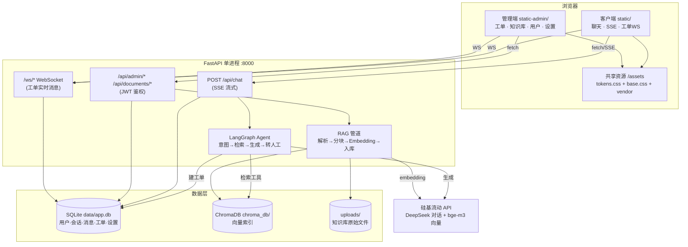
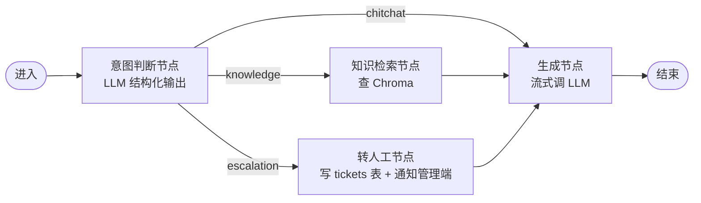

# AI 智能客服系统 · 重做方案 v2（全栈重做版）

> **本方案讲什么**：对现有"AI 智能客服系统"做一次**前后端全部推翻重做**的完整施工图——不是换皮，而是把系统重建为一个"真正由 LangGraph Agent 驱动、数据可靠落库、界面干净现代"的作品。
> **最终做出什么**：客户端聊天页（SSE 流式 + 知识库引用 + 转人工）+ 管理后台（工单/知识库/用户/设置）+ 桌面启动器 exe，三者共用一个 FastAPI 后端。
> **阅读前提**：会 Python、懂 MySQL 即可；生僻术语首次出现时都附有中文注释。
> **与 v1 方案的关系**：`docs/重做方案.md`（v1）主张"后端保留、只重写前端"；本 v2 方案经过对后端逐文件审查后**推翻了 v1 的前提**——后端问题比 v1 承认的严重得多（详见 §2.2），因此本方案与 v1 并列保存，以本方案为准。

---

## 目录

1. [背景与目标](#1-背景与目标)
2. [现状审查结论（为什么连后端一起重做）](#2-现状审查结论为什么连后端一起重做)
3. [概念铺垫：从旧知识到新技术](#3-概念铺垫从旧知识到新技术)
4. [总体架构](#4-总体架构)
5. [分模块详细设计](#5-分模块详细设计)
   - 5.1 数据层（SQLite + SQLModel）
   - 5.2 LLM 接入层（单一 OpenAI 兼容通路）
   - 5.3 RAG 知识库管道
   - 5.4 LangGraph Agent（本次重做的灵魂）
   - 5.5 聊天接口与 SSE 契约
   - 5.6 工单与实时通信
   - 5.7 认证与权限
   - 5.8 前端（客户端 + 管理端）
   - 5.9 启动器与打包
6. [功能取舍（P0 / P1 / P2）](#6-功能取舍p0--p1--p2)
7. [实施路线图](#7-实施路线图)
8. [风险与运维](#8-风险与运维)
9. [待确认事项](#9-待确认事项)
10. [附录：术语速查表](#10-附录术语速查表)

---

## 1. 背景与目标

### 1.1 项目定位

这个项目有**双重目的**：

1. **成品**：一个能真实跑起来、给别人演示不丢人的 AI 客服系统（含桌面 exe 交付）。
2. **学习载体**：你正在学习智能体开发（RAG、LangChain/LangGraph、Agent、向量数据库），这个项目应该是这些技术的**真实练兵场**，而不是把它们的名字写在 README 里装点门面。

第二点正是现有代码最大的讽刺：项目号称"RAG + Agent 全栈客服平台"，但审查发现 **LangGraph Agent 是从未被调用的死代码**（`backend/app/agents/customer_agent.py` 定义了完整的状态图，却没有任何路由或服务 import 它），实际聊天链路只是"向量检索 + 一次 LLM 调用"。作为学习载体，它教给你的是错的。

### 1.2 演进对比：三个版本的定位

| 阶段 | 类比你熟悉的做法 | 短板 |
|---|---|---|
| 现状（基线 6dd2c14） | 用 Python 脚本 + 全局变量 + 散落的 JSON 文件拼出来的系统 | Agent 是死代码；会话存内存重启即丢；配置热更新有 Bug；接口无鉴权裸奔；依赖臃肿 |
| v1 方案（做了一半的前端重写） | 数据库表结构烂着不管，只重画报表界面 | 前端确实变好了，但"假 Agent、丢数据、配置 Bug"一个都没解决 |
| **本方案 v2（全栈重做）** | 重新建库建表 + 重写业务层 + 重画界面，一次到位 | 工期比 v1 长（约 6-7 个开发会话），需要严格按里程碑推进 |

### 1.3 验收标准（做完后逐条检验）

- [ ] **真 Agent**：聊天请求进入 LangGraph 状态图，意图判断由 LLM 完成（不是关键词 if/else），检索/转人工是图中的节点；前端能实时看到 Agent 走到哪一步。
- [ ] **数据可靠**：重启服务后，历史会话、消息、工单、用户全部还在（SQLite 落库）；访客只能看到自己的会话。
- [ ] **配置即时生效**：管理端修改 LLM API 配置后，下一条聊天立即用新配置，无需重启。
- [ ] **全流程可用**：上传 PDF → 提问命中知识库并显示引用 → 说"转人工" → Agent 自动建工单 → 管理端接单实时对话 → 解决关单。
- [ ] **交付完整**：PyInstaller 打包的 exe 双击后拉起服务并打开客户端 + 管理端两个窗口；断网环境下页面样式与功能完好（无 CDN 依赖）。

### 1.4 本期不做什么（边界）

- 不引入 Node/npm 构建链和前端框架（React/Vue）——零构建原生前端对当前规模足够，且保住"看得懂每一行"的学习价值。
- 不做多租户、不做水平扩展、不做微服务——单机单进程。
- 不做移动端专门适配（保证桌面体验，窄屏可用即可）。
- 不维护 Docker 文件（保留不动）。
- 不做语音、图片多模态输入。

---

## 2. 现状审查结论（为什么连后端一起重做）

### 2.1 审查方式

逐文件读完 `backend/app/` 全部 27 个 Python 文件、半成品前端、`launcher.py`、依赖清单后得出以下结论。每条都可以在代码里指认。

### 2.2 后端问题清单（按严重程度排序）

| # | 问题 | 位置 | 严重性 |
|---|---|---|---|
| 1 | **LangGraph Agent 是死代码**：`CustomerAgent` 无任何调用方；且其"意图分类"节点是关键词匹配 if/else，图的所有分支都通向 END、生成环节根本不在图里 | `agents/customer_agent.py` | 致命（学习目标落空） |
| 2 | **配置热更新 Bug**：管理端改 API Key 后只 reload 了 `core/llm_client.py` 的全局单例，但 `chat.py`/`customer.py`/`admin.py` 三个路由各自 `ChatService()` → 各自 `LLMClient()`，这些实例永不刷新，聊天仍用旧配置 | `routers/admin.py:279` vs `services/chat_service.py:123` | 高（功能性 Bug） |
| 3 | **会话只存内存**：`SessionStore` 注释写着"JSON 文件持久化"实际一行持久化代码都没有，重启全丢；会话不绑定任何用户身份，`GET /api/sessions` 无鉴权，任何人可拉取所有人的对话 | `services/chat_service.py:48` | 高（丢数据 + 隐私裸奔） |
| 4 | **双份复制粘贴的 SSE 路由**：`/api/chat` 与 `/api/customer/chat` 两段几乎逐字相同的 60 行事件流代码 | `routers/chat.py` / `routers/customer.py` | 中（维护性） |
| 5 | **依赖严重臃肿**：llama-index 装了 6 个包实际只用 `SimpleDirectoryReader` 和 `SentenceSplitter` 两个类；`unstructured`（巨型依赖）、`anthropic`、`groq` 基本没用 | `requirements.txt` | 中（安装慢、打包大） |
| 6 | **Demo 模式塞了约 100 行硬编码营销文案**，与真实逻辑纠缠在 LLM 客户端里 | `core/llm_client.py:104-196` | 中（代码质量） |
| 7 | CORS `allow_origins=[..., "*"]` 且 `allow_credentials=True`；管理端多个接口用裸 `dict` 接收请求体不做校验 | `main.py:75`、`routers/admin.py` | 中（安全） |
| 8 | 每次健康检查/每次 Agent 调用都重新 `DocumentRetrieval()` 重连 Chroma | `main.py:101` 等 | 低（性能） |
| 9 | 三套手写"JSON 文件 + 线程锁"存储（users/escalations/settings）重复造轮子，各有细微差异 | `services/*_service.py` | 低（用数据库一并解决） |

**可以保留的资产**：SSE 事件设计思路、工单状态机（waiting → in_progress → resolved）、`launcher.py`（质量尚可，仅需适配）、`.env` 配置思路、Chroma + 硅基流动 bge-m3 的选型、上一轮前端的设计令牌思路和 vendor 本地化做法（`static-shared/vendor/` 的 marked/purify 文件直接复用）。

### 2.3 半成品工作区的处理

当前工作区有大量未提交改动（上一轮按 v1 方案做了一半的前端）。处理方式：

1. `git add -A && git commit -m "wip: v1 前端重写半成品（存档）"` 提交到新分支 `archive/v1-frontend-wip`——**不删任何东西，全部进 git 历史可随时翻看**；
2. 从基线 `6dd2c14` 开出新分支 `v3-rebuild`，在其上按本方案重做；
3. 半成品中可直接复用的文件（`static-shared/vendor/*.js` 两个库文件）从存档分支 checkout 过来。

> 这相当于 MySQL 里"先 `CREATE TABLE bak_xxx AS SELECT ...` 备份再动手改表"——用 git 分支做备份，成本为零，永远有退路。

---

## 3. 概念铺垫：从旧知识到新技术

本章把这次重做涉及的每个新概念，都从你已掌握的 Python/MySQL 知识里找到锚点。已经熟悉的可跳读。

### 3.1 JSON 文件存储 → SQLite

**旧做法**：现有代码用三套"读 JSON 文件到 dict + 线程锁 + 整文件重写"来存用户、工单、设置。这就像用 Excel 文件当数据库：每改一行都要重写整个文件，没有事务，没有查询能力，两个请求同时写还可能互相覆盖。

**为什么不够用**：会话和消息是持续增长的数据（一次对话几十条消息），整文件重写的代价线性上涨；"查某访客最近 10 条会话"这种需求要自己写全量扫描 + 排序，而这恰恰是你最熟悉的 SQL 一行就能做的事。

**新做法**：换 **SQLite**——把它理解为"单文件版 MySQL"：不需要装服务、不需要账号密码，整个库就是项目里的一个 `data/app.db` 文件，但 SQL 语法、事务、索引、外键与 MySQL 几乎一致。你的 SQL 思维 100% 复用。配合 **SQLModel**（FastAPI 作者写的 ORM，底层是 SQLAlchemy），一个 Python 类同时就是"表结构 + 数据校验模型"。

> **注释：ORM（对象关系映射）**——用 Python 类和对象来操作数据库表和行，`session.add(user)` 替代手写 `INSERT INTO users ...`。类比：你写过的 `pymysql` 手拼 SQL 是"手动挡"，ORM 是"自动挡"，底层还是同样的 SQL。

**为什么不直接用 MySQL**：本项目要打包成"双击就能跑"的 exe 给别人用，MySQL 需要单独安装服务端，交付复杂度暴涨。SQLite 零安装随项目走。（代码用 SQLModel 写好后，将来真要换 MySQL 只需改一行连接串——这也是 ORM 的价值。）

### 3.2 关键词 if/else → LLM 意图判断

**旧做法**：现有"意图分类"是这样的（真实代码）：

```python
ESCALATION_KEYWORDS = ["转人工", "人工客服", "找人工", ...]
for kw in ESCALATION_KEYWORDS:
    if kw in message:
        state["intent"] = "escalation"
```

**为什么不够用**：用户说"机器人答不明白，给我个活人"——没命中任何关键词，规则失效。穷举关键词就像用 `WHERE title LIKE '%人工%'` 做搜索：字面匹配，不懂语义。

**新做法**：把意图判断交给 LLM 本身，用**结构化输出**（让模型按 JSON Schema 返回 `{"intent": "escalation"}`），模型理解的是语义而非字面。这是从"手写规则"到"模型推理"的范式转换——规则代码你写多少它会多少，模型天生就懂"给我个活人 = 转人工"。

### 3.3 线性函数调用 → LangGraph 状态图

**旧做法**：普通聊天机器人的代码是一条直线：`收消息 → 检索 → 拼 prompt → 调 LLM → 返回`。用 Python 函数顺序调用就能写。

**为什么不够用**：真实客服流程有**分支和环**：意图不同走不同路（问候不用检索、投诉要建工单）；检索结果不佳可能要改写查询重试；未来还要加"查订单""办退款"等工具。用 if/else 编排这些分支，代码会迅速纠缠成面条。

**新做法**：**LangGraph** 把流程显式建模为**状态图**——节点是处理函数，边是流转规则，一个共享的 State（就是个 TypedDict）在节点间传递。类比：它像把你脑中的流程图直接变成可执行代码，或者说像数据库的执行计划（EXPLAIN）——每一步做什么、下一步去哪，看图即知。本次重做的核心就是把这张图**真正接入聊天链路**，并把每个节点的进展实时推给前端展示。

### 3.4 LIKE 模糊查询 → 向量检索（复习）

这块现有实现是对的，保留：`LIKE '%退款%'` 只能匹配字面；向量检索先把文本变成语义坐标（embedding，bge-m3 输出 1024 维向量），"怎么退钱"和"退款流程"在坐标空间里距离很近，靠**余弦相似度**就能找到。ChromaDB 就是存这些向量并提供近邻查询的数据库——类比 MySQL 的索引加速 `WHERE`，向量库的 HNSW 索引加速"找最近的 K 个向量"。

### 3.5 新旧知识清单

| 保留复用 | 替换舍弃 |
|---|---|
| SQL 思维（建表、外键、索引、事务）→ 直接用于 SQLite 表设计 | 手写"JSON 文件 + 线程锁"存储 → SQLite |
| Python 语法、类型标注、异步 async/await | 关键词 if/else 意图分类 → LLM 结构化输出 |
| HTTP/REST 概念、FastAPI 路由写法 | 线性函数调用编排 → LangGraph 状态图 |
| Chroma + bge-m3 向量检索选型 | llama-index 全家桶 → 轻量的 langchain-text-splitters + 手写文档解析 |
| SSE 事件流设计、工单状态机 | 多 LLM 提供商分支代码 → 单一 OpenAI 兼容通路 |

---

## 4. 总体架构

### 4.1 贯穿全文的示例场景

后续所有章节的示例围绕这个场景展开：

> 管理员在后台上传《产品手册.pdf》（含退款政策）。访客小王打开客户端问：**"你们支持退款吗？"**——Agent 判断为知识问题 → 检索命中手册片段 → 流式生成带引用的回答。小王接着说：**"说了半天没解决，给我个活人！"**——Agent 判断为转人工意图 → 自动创建工单 → 管理员在后台收到实时通知，接管工单与小王双向对话，解决后关单。

### 4.2 架构图



### 4.3 技术选型总表

| 层/模块 | 技术选型 | 理由 | 为什么不选主流替代 |
|---|---|---|---|
| Web 框架 | FastAPI + uvicorn | 已熟悉，异步 + SSE + WS 一站式 | Flask：异步与 SSE 支持弱 |
| 业务数据 | **SQLite + SQLModel** | 零安装单文件、SQL 思维复用、exe 交付友好 | MySQL：交付要装服务端；继续 JSON：见 §3.1 |
| 向量库 | ChromaDB（保留） | 已可用，本地持久化，学习成本已付 | FAISS：无元数据管理；pgvector：要装 PG |
| Agent 编排 | **LangGraph**（真接入） | 学习目标本体；状态图表达分支流程 | 裸写 if/else：正是要淘汰的旧范式 |
| LLM 接入 | openai SDK 单通路（base_url 指向硅基流动） | 硅基流动/OpenAI/DeepSeek 官方 API 全是 OpenAI 兼容格式，一套代码通吃 | 保留 anthropic/groq SDK：三倍维护成本，实际只用硅基流动 |
| 文档解析/分块 | pypdf + python-docx + **langchain-text-splitters** | 三个小依赖替换 llama-index 六件套 + unstructured；且 langchain 系正是你的学习路线 | llama-index：为用两个类背一个全家桶 |
| JWT | **PyJWT** | 轻量、API 简单 | python-jose：依赖重且维护放缓 |
| 前端 | 零构建原生 HTML/CSS/JS（ES Module）+ 设计令牌 | 看得懂每一行、FastAPI 直接托管、打包简单 | React+Vite：引入 Node 工具链，超出当前学习主线且收益不明显 |
| Markdown 渲染 | marked + DOMPurify（本地 vendor，复用现有文件） | LLM 输出不可信必须消毒（XSS 防护） | — |
| 启动器 | 现有 launcher.py 微调保留 | 审查结论：质量合格，无重写必要 | — |

> **注释：OpenAI 兼容接口**——各家 LLM 厂商都按 OpenAI 的 `/v1/chat/completions` 请求格式提供服务，只要换 `base_url` 和 `api_key`，同一套 `openai` SDK 代码就能调不同厂商。类比：不同品牌的数据库都支持标准 SQL，你的查询代码不用换。

---

## 5. 分模块详细设计

### 5.1 数据层（SQLite + SQLModel）

**解决什么问题**：§2.2 问题 3、9——会话丢失、无身份归属、三套手写 JSON 存储。

依赖安装：`pip install sqlmodel`（自带 SQLAlchemy + pydantic 集成）。

核心表结构（SQLite DDL，与 MySQL 语法几乎一致，`AUTOINCREMENT` 对应 `AUTO_INCREMENT`）：

```sql
-- 管理端用户（客服/管理员）
CREATE TABLE users (
    id          TEXT PRIMARY KEY,            -- uuid
    email       TEXT UNIQUE NOT NULL,
    name        TEXT NOT NULL,
    password_hash TEXT NOT NULL,             -- bcrypt
    role        TEXT NOT NULL DEFAULT 'agent',  -- super_admin / agent
    created_at  TEXT NOT NULL
);

-- 访客会话（visitor_id 由浏览器 localStorage 生成的 uuid，实现"匿名但有归属"）
CREATE TABLE sessions (
    id          TEXT PRIMARY KEY,
    visitor_id  TEXT NOT NULL,
    title       TEXT NOT NULL DEFAULT '新会话',
    created_at  TEXT NOT NULL,
    updated_at  TEXT NOT NULL
);
CREATE INDEX idx_sessions_visitor ON sessions(visitor_id, updated_at DESC);

-- 消息（会话 1:N 消息，等价于 MySQL 外键关联）
CREATE TABLE messages (
    id          INTEGER PRIMARY KEY AUTOINCREMENT,
    session_id  TEXT NOT NULL REFERENCES sessions(id) ON DELETE CASCADE,
    role        TEXT NOT NULL,               -- user / assistant
    content     TEXT NOT NULL,
    sources     TEXT,                        -- JSON 数组：知识库引用快照
    created_at  TEXT NOT NULL
);

-- 工单
CREATE TABLE tickets (
    id          TEXT PRIMARY KEY,
    session_id  TEXT NOT NULL,
    visitor_id  TEXT NOT NULL,
    status      TEXT NOT NULL DEFAULT 'waiting',  -- waiting/in_progress/resolved
    reason      TEXT,
    assignee_id TEXT REFERENCES users(id),
    created_at  TEXT NOT NULL,
    resolved_at TEXT
);

-- 工单消息 + 知识库文档元数据 + 运行时设置（键值表）同理，略
```

SQLModel 写法示例（一个类 = 表结构 + 校验模型）：

```python
from sqlmodel import SQLModel, Field, create_engine, Session

class Message(SQLModel, table=True):
    __tablename__ = "messages"
    id: int | None = Field(default=None, primary_key=True)
    session_id: str = Field(foreign_key="sessions.id", index=True)
    role: str
    content: str
    sources: str | None = None
    created_at: str

engine = create_engine("sqlite:///data/app.db")
SQLModel.metadata.create_all(engine)   # 建表，等价于执行上面的 DDL
```

**数据迁移**：写一次性脚本 `scripts/migrate_json.py`，把 `data/users.json` 的用户（含 bcrypt 哈希，直接搬）导入 `users` 表；旧工单/会话数据价值低，默认弃用（⚠️ 待确认 4）。

**检查清单**
- [ ] 重启服务后会话与消息完整保留
- [ ] 两个浏览器（不同 visitor_id）互相看不到对方会话
- [ ] users.json 迁移脚本执行后能用旧密码登录

### 5.2 LLM 接入层（单一 OpenAI 兼容通路）

**解决什么问题**：§2.2 问题 2、6——配置热更新失效、Demo 文案污染。

设计决策：

1. 全局**唯一**的 `LLMGateway` 实例（FastAPI `app.state` 持有），所有路由共享——配置一处 reload，处处生效，根治问题 2。
2. 只走 `openai` SDK 一条通路，`provider` 概念简化为 `(base_url, api_key, chat_model, embedding_model)` 四元组，存 SQLite `settings` 表，管理端在线改。
3. **删除 Demo 模式**的百行文案：未配置 Key 时，聊天接口直接返回一条明确的系统提示（"尚未配置 API Key，请到管理端设置"），前端显示引导条。诚实的报错比假装聊天更利于排查。

```python
from openai import AsyncOpenAI

class LLMGateway:
    """全局唯一 LLM 出口。配置改动后调用 reload() 即热生效。"""
    def __init__(self, config_loader):
        self._load = config_loader      # 从 settings 表读配置的函数
        self.reload()

    def reload(self) -> None:
        cfg = self._load()
        self.chat_model = cfg.chat_model
        self.embedding_model = cfg.embedding_model
        self._client = AsyncOpenAI(api_key=cfg.api_key, base_url=cfg.base_url)

    async def chat_stream(self, messages: list[dict]):
        stream = await self._client.chat.completions.create(
            model=self.chat_model, messages=messages, stream=True)
        async for chunk in stream:
            if chunk.choices[0].delta.content:
                yield chunk.choices[0].delta.content

    async def embed(self, texts: list[str]) -> list[list[float]]:
        resp = await self._client.embeddings.create(
            model=self.embedding_model, input=texts)
        return [d.embedding for d in resp.data]
```

**检查清单**
- [ ] 管理端改 Key 后，不重启，下一条聊天即用新 Key（用错误 Key 验证会立即报错）
- [ ] 全项目 `grep AsyncOpenAI` 只出现在这一个文件

### 5.3 RAG 知识库管道

**解决什么问题**：§2.2 问题 5、8——依赖臃肿、Chroma 重复连接。

依赖：`pip install chromadb pypdf python-docx langchain-text-splitters`。

流程与现有一致（解析 → 分块 → Embedding → 入 Chroma），但实现瘦身：

```python
from langchain_text_splitters import RecursiveCharacterTextSplitter

splitter = RecursiveCharacterTextSplitter(
    chunk_size=512, chunk_overlap=64,
    separators=["\n\n", "\n", "。", "！", "？", " ", ""],  # 中文友好
)

def parse_file(path: Path) -> str:
    """按扩展名解析纯文本。pdf→pypdf, docx→python-docx, txt/md 直接读。"""
    if path.suffix == ".pdf":
        from pypdf import PdfReader
        return "\n".join(page.extract_text() or "" for page in PdfReader(path).pages)
    if path.suffix == ".docx":
        from docx import Document
        return "\n".join(p.text for p in Document(path).paragraphs)
    return path.read_text("utf-8", errors="replace")
```

关键改进点：

- **Chroma 客户端全局单例**（与 LLMGateway 同样挂在 `app.state`），不再每次请求重建连接。
- 文档元数据（文件名、分块数、状态）入 SQLite `documents` 表，替代 `uploads/_documents_meta.json`。
- 检索相关性分数换成标准做法：collection 建立时声明 `metadata={"hnsw:space": "cosine"}`，用 `1 - cosine_distance` 作为分数，阈值 0.35 以下的结果丢弃（现有的 `1/(1+distance)` 是自造公式，分数没有可解释性）。
- 示例场景验证：上传《产品手册.pdf》后，"你们支持退款吗？"的检索结果应包含退款政策片段且分数 > 0.5。

**检查清单**
- [ ] PDF/DOCX/TXT/MD 各上传一个，均能解析入库
- [ ] 删除文档后，向量库中该文档所有分块同步删除（用 chunk 计数验证）
- [ ] `pip install` 总时长与包体积显著小于现状（无 unstructured/llama-index）

### 5.4 LangGraph Agent（本次重做的灵魂）

**解决什么问题**：§2.2 问题 1——把死代码变成真正驱动聊天的 Agent，同时把"关键词分类"升级为 LLM 判断。

依赖：`pip install langgraph langchain-core`。

状态图设计（刻意保持四节点的可理解规模，不炫技）：



核心代码骨架（可直接照此实现）：

```python
from typing import TypedDict, Literal
from langgraph.graph import StateGraph, START, END
from pydantic import BaseModel

class AgentState(TypedDict):
    user_message: str
    history: list[dict]        # 从 messages 表读的最近几轮
    intent: str
    context: str               # 检索到的知识拼接文本
    sources: list[dict]        # 引用（给前端展示）
    ticket_id: str | None      # 转人工时创建的工单

class IntentResult(BaseModel):
    """LLM 结构化输出的意图，替代关键词 if/else"""
    intent: Literal["knowledge", "escalation", "chitchat"]

async def classify(state: AgentState) -> dict:
    # 用小 prompt + response_format 让 LLM 输出 JSON，解析进 IntentResult
    result = await llm.classify_intent(state["user_message"], state["history"])
    return {"intent": result.intent}

async def retrieve(state: AgentState) -> dict:
    hits = vector_store.search(state["user_message"], top_k=4)
    context = "\n\n".join(f"【资料{i+1}·{h['filename']}】{h['text']}"
                          for i, h in enumerate(hits))
    return {"context": context, "sources": [h.meta() for h in hits]}

async def escalate(state: AgentState) -> dict:
    ticket = ticket_service.create(session_id=..., reason=state["user_message"])
    await ws_manager.notify_admins({"type": "new_ticket", "ticket": ticket})
    return {"ticket_id": ticket.id}

def build_graph():
    g = StateGraph(AgentState)
    g.add_node("classify", classify)
    g.add_node("retrieve", retrieve)
    g.add_node("escalate", escalate)
    g.add_node("generate", generate)          # 内部流式产出 token
    g.add_edge(START, "classify")
    g.add_conditional_edges("classify", lambda s: s["intent"], {
        "knowledge": "retrieve", "escalation": "escalate", "chitchat": "generate",
    })
    g.add_edge("retrieve", "generate")
    g.add_edge("escalate", "generate")        # 建单后仍生成一句安抚话术
    g.add_edge("generate", END)
    return g.compile()
```

与现有死代码的三个本质区别：

1. **真的被调用**：`/api/chat` 的处理函数就是 `graph.astream(...)`，不存在第二条聊天链路。
2. **意图判断是 LLM**：`classify` 节点调模型出结构化 JSON；"给我个活人"能被正确识别。
3. **生成在图内且流式**：用 LangGraph 的 `astream_events` 把 `generate` 节点内的 token 逐个取出转发给 SSE——同时每进入一个节点就向前端发一条 `agent_step` 事件，**前端可视化 Agent 的思考步骤**（"识别意图 → 检索知识库 → 生成回答"进度条），这既是产品亮点也是最好的学习反馈。

**检查清单**
- [ ] "你们支持退款吗" → 走 retrieve 分支，回答带引用
- [ ] "给我个活人"（无"人工"关键词）→ 走 escalate 分支，tickets 表新增记录
- [ ] "你好呀" → 走 chitchat 分支，不做无谓检索
- [ ] 前端能看到 agent_step 事件序列

### 5.5 聊天接口与 SSE 契约

**解决什么问题**：§2.2 问题 4——合并双路由为一个 `/api/chat`。

SSE 事件契约（v3，前后端唯一契约，冻结后双方照此开发）：

| 事件 | data 载荷 | 说明 |
|---|---|---|
| `session` | `{session_id}` | 新会话时返回 ID |
| `agent_step` | `{step, label}` | Agent 进入某节点（classify/retrieve/escalate/generate） |
| `sources` | `{sources: [{filename, snippet, score}]}` | 知识库引用 |
| `ticket` | `{ticket_id}` | Agent 自动建了工单 |
| （无名事件） | `{content}` | 流式 token |
| `done` | `{}` | 结束 |
| `error` | `{message}` | 出错 |

路由骨架：

```python
@router.post("/api/chat")
async def chat(req: ChatRequest):            # ChatRequest: message, session_id, visitor_id
    async def gen():
        async for event in agent_runner.run_stream(req):
            yield sse_format(event)          # 统一的 "event: x\ndata: {...}\n\n" 格式化
    return StreamingResponse(gen(), media_type="text/event-stream")
```

### 5.6 工单与实时通信

现有工单状态机（waiting → in_progress → resolved）设计合理，**保留逻辑、换存储**（SQLite）。WebSocket 双端点保留：`/ws/customer/{ticket_id}`（访客侧）与 `/ws/admin`（管理端，JWT 校验）。改进两点：

1. Agent 的 escalate 节点自动建单（现状是前端按钮手动调接口，两条链路并存），前端"转人工"按钮仍保留，走同一个服务函数。
2. 工单消息入 `ticket_messages` 表，断线重连后用 REST 拉全量补齐，WS 只做增量推送——"REST 保底、WS 提速"，避免消息丢失。

### 5.7 认证与权限

- 管理端：邮箱 + 密码登录，bcrypt 哈希，PyJWT 签发 8 小时 token；角色简化为两级 `super_admin`（用户管理 + API 配置）/ `agent`（工单 + 知识库）——现状三级角色在这个规模下是多余的复杂度。
- 首个注册用户自动成为 super_admin（保留现有做法），**注册接口在已存在 super_admin 后自动关闭**，改为由管理员在后台创建账号——堵住"任何人可注册"的口子。
- 访客端：不登录，浏览器 localStorage 生成 `visitor_id`（uuid），随每个请求携带；会话按 visitor_id 隔离。查询会话的接口必须带 visitor_id 匹配校验。
- CORS：同源部署（FastAPI 托管前端），生产模式下收紧为不允许跨域；`DEBUG=true` 时才放开 localhost 端口。

### 5.8 前端（客户端 + 管理端）

**继承半成品中验证过的正确做法**：设计令牌 + 共享基础样式（`static-shared/` 挂载 `/assets`）、vendor 本地化（marked/DOMPurify 文件直接复用）、hash 路由的管理端单页结构、深浅色主题。这些思路不推翻，**代码按 v3 契约重写**。

**视觉方向（v2 更换）**：v1 用"暖纸面 + 深松绿"；本方案改为「**冷静灰白 + 靛蓝**」——纯净中性底色（浅色 `#FAFAF9` / 深色 `#17181C`），主色靛蓝 `#4F46E5` 只出现在按钮、链接、选中态、Agent 步骤条等视线引导处，整体对标 Linear/Vercel 式的安静工具感（⚠️ 待确认 1）。

设计令牌骨架：

```css
:root {
  --bg: #FAFAF9;  --surface: #FFFFFF;  --surface-2: #F4F4F2;
  --border: #E7E6E3;  --text: #1A1A1A;  --text-2: #8A8880;
  --accent: #4F46E5;  --accent-hover: #4338CA;  --accent-soft: #EEEDFC;
  --danger: #DC2626;  --radius: 10px;
  --font: "Segoe UI Variable","Segoe UI","PingFang SC","Microsoft YaHei UI",sans-serif;
}
[data-theme="dark"] {
  --bg: #17181C;  --surface: #1F2025;  --surface-2: #26272D;
  --border: #33343B;  --text: #E9E9E7;  --text-2: #8D8E95;
  --accent: #818CF8;  --accent-hover: #A5B0FA;  --accent-soft: #26283D;
}
```

**客户端版式**：单列对话流（最大 760px 居中）+ 260px 可收起会话侧栏；用户消息右侧靛蓝气泡，**AI 回答无气泡直排** + 头部一条小小的 Agent 步骤指示（"已检索知识库 · 4 条引用"可展开）；底部悬浮输入卡（textarea 自动增高，Enter 发送）；空状态放 3 个示例问题卡片。

**管理端版式**：左侧 220px 侧栏（概览 / 工单 / 会话 / 知识库 / 用户 / 设置）+ 内容区；工单页为列表-详情双栏，详情底部固定回复框，WS 新工单实时插入列表并高亮；知识库页上传拖拽区 + 文档表格（状态、分块数、删除/重建）；设置页 API 四元组表单 + 保存即热生效提示。

**目录结构**：

```
static/                    # 客户端
├─ index.html
├─ css/app.css
└─ js/  api.js(fetch+SSE)  chat.js(消息渲染)  sessions.js  app.js(入口)
static-admin/              # 管理端（hash 路由单页）
├─ index.html
├─ css/admin.css
└─ js/  api.js  router.js  ui.js(通用组件)  pages/{overview,tickets,knowledge,users,settings}.js
static-shared/             # 挂 /assets，两端共享
├─ css/tokens.css  css/base.css
└─ vendor/  marked.min.js  purify.min.js      # 从存档分支复用
```

**检查清单**
- [ ] 断网刷新，样式与 Markdown 渲染完好（无 CDN）
- [ ] LLM 输出中的 `<script>` 被 DOMPurify 消毒（手动构造验证）
- [ ] 深浅色切换 + 记忆；两端风格肉眼一致

### 5.9 启动器与打包

`launcher.py` 审查结论：结构清晰（环境检查 → 依赖安装 → 起服务 → 健康轮询 → app 模式开窗），**保留**，仅两处适配：健康检查响应字段对齐 v3、配色常量对齐新令牌。打包命令不变：

```powershell
pyinstaller --onefile --windowed --name AI智能客服系统 launcher.py
```

---

## 6. 功能取舍（P0 / P1 / P2）

| 级别 | 功能 |
|---|---|
| **P0 必须**（不做完不算交付） | SQLite 数据层 + users.json 迁移；LLMGateway 热更新；RAG 上传/删除/重建/检索；LangGraph Agent 三分支 + agent_step 事件；SSE 聊天 + 会话持久化 + visitor 隔离；工单全流程（Agent 自动建单 + 手动按钮 + 管理端接管/回复/解决 + WS 实时）；管理端登录/工单/知识库/设置四页；客户端完整聊天体验；深浅色主题；launcher 适配回归 |
| **P1 重要**（顺延不影响验收） | 管理端概览统计卡片 + 近 7 日会话量迷你图（纯 CSS，不引 Chart.js）；用户管理页；消息复制按钮；客户端空状态示例问题；检索失败时 Agent 的"知识库无相关内容"诚实话术优化 |
| **P2 以后再说** | 代码块语法高亮；会话导出；意图统计报表；查询改写（检索不佳时让 LLM 重写查询再检一次）；多知识库分库 |

---

## 7. 实施路线图

阶段粒度按"一次专注的开发会话能完成"划分，前一阶段验收不过不进下一阶段。

| 阶段 | 预估 | 关键任务 | 产出物 | 验收标准 |
|---|---|---|---|---|
| **M0 存档与地基** | 0.5 会话 | ① 半成品提交到 `archive/v1-frontend-wip` 分支；② 从 6dd2c14 开 `v3-rebuild` 分支；③ 清理旧后端为新骨架目录；④ 新 requirements.txt + 依赖安装；⑤ config + SQLite 建表 | 可启动的空 FastAPI + app.db | 服务启动，`/api/health` 200，app.db 各表已建 |
| **M1 数据与认证** | 1 会话 | SQLModel 模型；用户服务 + PyJWT 登录；users.json 迁移脚本；会话/消息 CRUD（visitor 隔离） | 认证可用的数据层 | 旧账号密码能登录；两个 visitor 会话互不可见；重启数据不丢 |
| **M2 LLM 与 RAG** | 1 会话 | LLMGateway（热更新）；文档解析/分块/embedding/入 Chroma；documents 表；检索函数 + 余弦分数 | 知识库管道 | 上传《产品手册.pdf》，检索"退款"返回相关片段且分数合理；改 Key 热生效 |
| **M3 Agent 与聊天** | 1 会话 | LangGraph 四节点图；意图结构化输出；`/api/chat` SSE（v3 契约）；消息落库 | 完整聊天后端 | curl 验证三条示例消息各走对分支；agent_step/sources/token 事件序列正确 |
| **M4 客户端前端** | 1 会话 | tokens/base.css；聊天页全部功能（流式渲染、引用、Agent 步骤条、会话侧栏、转人工、主题） | 可用的客户端 | §1.3 验收第 4 条的前半段全过；断网刷新完好 |
| **M5 管理端前端** | 1 会话 | 登录页；hash 路由骨架；工单双栏 + WS 实时；知识库页；设置页 | 可用的管理端 | 登录 → 接管示例场景的工单 → 双向对话 → 关单；上传/删除文档 |
| **M6 收尾交付** | 0.5-1 会话 | P1 项（概览统计等）；launcher 适配；PyInstaller 打包；全链路走查 §1.3 全部验收项；更新 README | exe + 完整系统 | §1.3 五条全部勾掉 |

**第一步从这里开始**：`git checkout -b archive/v1-frontend-wip && git add -A && git commit`，然后 `git checkout 6dd2c14 -b v3-rebuild`。

**重做后的项目目录树**：

```
AI客服/
├─ backend/app/
│  ├─ main.py            # 应用装配：lifespan 里初始化 LLMGateway/Chroma 单例
│  ├─ config.py          # pydantic-settings，读 .env
│  ├─ db.py              # SQLite engine + 建表
│  ├─ models.py          # SQLModel 表模型（users/sessions/messages/tickets/documents/settings）
│  ├─ schemas.py         # 请求/响应 Pydantic 模型（消灭裸 dict）
│  ├─ security.py        # bcrypt + PyJWT
│  ├─ llm.py             # LLMGateway（全局唯一 LLM 出口）
│  ├─ rag/               # loader.py 解析 / pipeline.py 分块入库 / store.py Chroma 封装
│  ├─ agent/             # graph.py 状态图 / nodes.py 节点函数 / prompts.py
│  ├─ routers/           # chat.py / auth.py / tickets.py / documents.py / admin.py / ws.py
│  └─ services/          # session_service.py / ticket_service.py / ws_manager.py
├─ scripts/migrate_json.py   # users.json → SQLite 一次性迁移
├─ static/  static-admin/  static-shared/   # 见 §5.8
├─ data/app.db  chroma_db/  uploads/        # 运行时数据（gitignore）
├─ docs/重做方案.md（v1，存档）  docs/重做方案v2.md（本文档）
├─ launcher.py  requirements.txt  .env  README.md
```

---

## 8. 风险与运维

| 风险 | 表现 | 对策 |
|---|---|---|
| 全栈重做工期失控 | M3 后热情耗尽，烂尾成新的半成品 | 严格按里程碑顺序：M0-M3 完成时即有"curl 可验证的完整后端"，任何时刻停下来都比现状好；P1 全部可砍 |
| LangGraph 流式事件学习曲线 | `astream_events` 的事件类型多，token 转发写不对 | M3 先写一个 10 行的最小 demo 脚本跑通"图内节点流式产 token"，再搬进项目；实在卡住可降级为"generate 节点不进图、图结束后在路由层流式生成"（架构上略退让，功能不受损） |
| 意图判断增加一次 LLM 调用 | 每条消息多 ~0.5s 延迟、多一点 token 费 | 用硅基流动上的小模型（如 Qwen 7B）做分类，快且便宜；agent_step 事件让用户"看到在思考"，感知延迟反而下降 |
| SQLite 并发写 | 极端并发下 database is locked | 单机自用规模几乎不会触发；打开 WAL 模式（`PRAGMA journal_mode=WAL`）预防；将来量大再迁 MySQL（ORM 使迁移成本≈改连接串） |
| Chroma 旧数据兼容 | 旧 collection 距离度量与新代码假设不一致 | 直接重建：M2 用管理端"重建索引"对 uploads/ 全量重灌一次（调用 bge-m3 会花少量 token，可接受） |
| 旧账号迁移遗漏 | 迁移脚本漏字段导致无法登录 | M1 验收项强制用 data/users.json 里的真实旧账号登录验证 |
| PyInstaller tcl/tk DLL | conda Python 打包后 tk 报错 | 沿用 v1 已验证的 `--add-binary` 方案；M6 在干净目录验证 exe |
| 前端浏览器缓存 | 新旧样式混杂 | 静态资源引用统一带 `?v=` 版本参数 |

**将来可能要调整的地方**（记录，不属于本期）：多访客高并发时 SQLite → MySQL；检索质量不满意时引入 rerank 模型；Agent 加"查订单"等业务工具节点（图结构天然支持扩展）。

---

## 9. 待确认事项

以下默认假设已写入方案，如无异议按此执行；有异议请在开工前拍板：

1. **⚠️ 视觉主色**：默认「冷静灰白 + 靛蓝 #4F46E5」（v1 是暖纸面 + 松绿）。改主色只动 tokens.css 一处，但请现在定。
2. **⚠️ 业务数据库用 SQLite**：默认 SQLite（单文件、exe 交付友好）。如果你更想在本项目里练 MySQL（本机装 MySQL 服务，交付性变差），请提出，代码层用 SQLModel 两者都支持。
3. **⚠️ 半成品处理**：默认全部提交到 `archive/v1-frontend-wip` 存档分支保留，不删除任何文件；新开发在 `v3-rebuild` 分支进行。
4. **⚠️ 旧数据迁移范围**：默认只迁移 `data/users.json`（账号）+ 重建 chroma 索引（uploads/ 原文件重灌）；旧工单 `escalations.json`、旧会话不迁移。
5. **⚠️ Demo 模式删除**：默认删除"无 Key 时返回假聊天内容"的 Demo 模式，改为明确的配置引导提示。若你需要"无 Key 也能给人演示 UI"的场景，请提出，可保留一个极简版。
6. **⚠️ 多 LLM 提供商**：默认只保留 OpenAI 兼容单通路（硅基流动为主，任何兼容厂商换 base_url 即用），删除 Anthropic/Groq 专用代码。

---

## 10. 附录：术语速查表

| 术语 | 全称 | 一句话解释 | Python/MySQL 类比 |
|---|---|---|---|
| SQLite | — | 单文件、零安装的嵌入式关系数据库 | 文件版 MySQL，SQL 语法基本通用 |
| SQLModel | — | FastAPI 作者写的 ORM，类=表结构+校验模型 | 替代 pymysql 手拼 SQL 的"自动挡" |
| ORM | Object-Relational Mapping | 用对象操作数据库表 | `session.add(u)` ≈ `INSERT INTO users...` |
| WAL | Write-Ahead Logging | SQLite 的日志模式，改善并发读写 | MySQL InnoDB 的 redo log 思路 |
| LangGraph | — | 把 Agent 流程建模为可执行状态图的框架 | 把流程图/执行计划直接变成代码 |
| 结构化输出 | Structured Output | 让 LLM 严格按 JSON Schema 返回结果 | 替代关键词 if/else 的"语义版规则引擎" |
| Embedding | 向量嵌入 | 把文本变成语义坐标（bge-m3 输出 1024 维） | 给文本建"语义索引"，供相似度查询 |
| 余弦相似度 | Cosine Similarity | 两向量夹角衡量语义接近度，1 为最相似 | 向量版的 `LIKE`，但懂语义 |
| ChromaDB | — | 本地持久化向量数据库 | 专存向量并加速"找最近 K 个"的 MySQL |
| RAG | Retrieval-Augmented Generation | 先检索资料再让 LLM 依据资料回答 | 开卷考试：先查书再作答 |
| SSE | Server-Sent Events | 服务器向浏览器单向推文本流 | 大结果集逐行返回而非整表加载 |
| WebSocket | — | 浏览器与服务器的双向长连接 | SSE 是单向广播，WS 是双向电话 |
| JWT | JSON Web Token | 自带签名的登录凭证，服务端无需存会话 | 盖了防伪章的通行证 |
| bcrypt | — | 抗暴力破解的密码哈希算法 | 存哈希不存明文，同 MySQL 用户表最佳实践 |
| XSS | 跨站脚本攻击 | 恶意 JS 混进页面内容执行 | SQL 注入的前端版，防法都是"先消毒" |
| ES Module | ECMAScript Module | 浏览器原生 import/export，免打包器 | Python 的 import，天生就有 |
| 设计令牌 | Design Token | 颜色/字号/间距做成全局 CSS 变量 | constants.py 常量模块 |
| hash 路由 | — | 用 URL 的 `#/xxx` 做单页内切换 | `if page == "tickets": render(...)` 的浏览器版 |
| PyInstaller | — | 把 Python 程序打成单个 exe | — |

---

> **请审阅本方案，确认或提出修改意见后再开始开发；尤其请先拍板「待确认事项」中的 6 个问题。** 确认后从 M0（半成品存档 + 新分支）开始施工。
